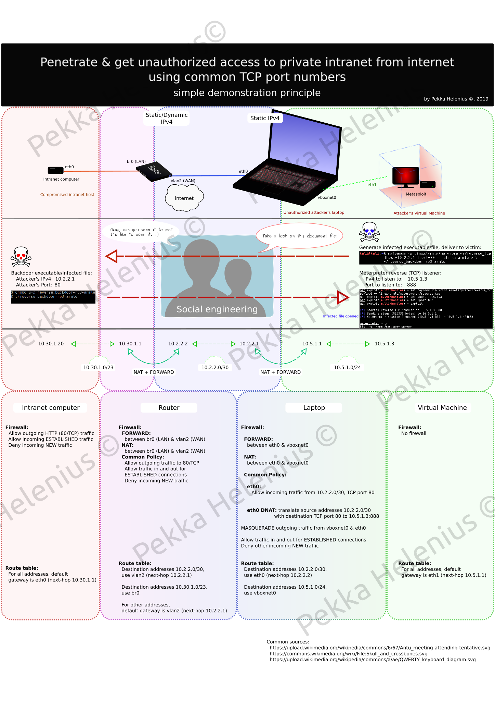
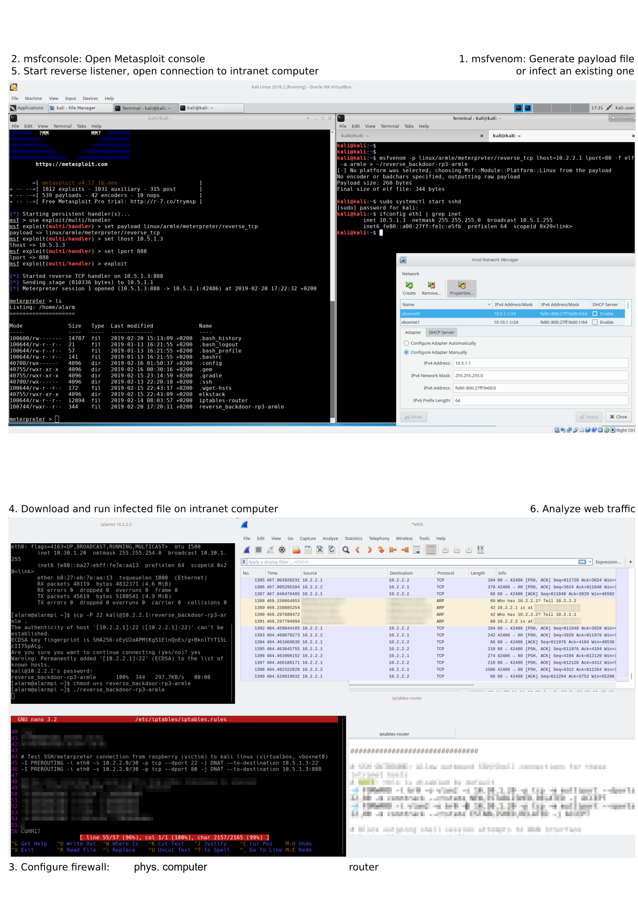

# Offensive penetration testing

Aim of this repository is to present and simulate multiple attack types against web applications and various OSes, including Microsoft Windows.

---------------

## About

**NOTE: Applying and carrying out the practices described below _can be considered as a criminal act_**. Instructions described on this website have been carried out in a precisely limited scope/environment, in accordance with the terms of use, and accepted by all relevant parties beforehand without affecting outside parties. The hostile practices defined here are not directed to any innocent third parties.

Before utilizing these instructions in your environment, make sure that your actions will be legal and authorized, carried out in a limited scope and with transparency so that every affected party is aware of your actions and accepted them in full scale beforehand. In addition, any affected party must know consequences and risks involved in your actions.

**DISCLAIMER:** Author of the instructions neither encourage or take responsibility of any misuse or criminal actions which are based on the instructions below!

---------------

**This repository...**

- ...utilizes [OWASP top 10 list of the most common attack types](https://www.owasp.org/images/7/72/OWASP_Top_10-2017_%28en%29.pdf.pdf)

- ...utilizes multiple penetration methods with various tools, including [Kali Linux](https://www.kali.org) and [Metasploit Framework](https://www.metasploit.com)

The repository is mainly set up as a requirement by a school cource in Haaga-Helia University of Applied Sciences, Helsinki, Finland. It contains various exercises, currently presented in Finnish but will be translated into English later.

## Table of Contents

- [Exercise 1]() - OWASP Top 10, OWASP WebGoat

- [Exercise 2]() - HackTheBox Environment, Nmap (port scanning), Metasploit Framework, OWASP WebGoat

- [Exercise 3]() - Vulnerability Scanners (passwords, directories, ports etc.), Source Code Analysis of a Malicious Program, Authentication Bypass

- [Exercise 4]() - CTF Hacking Challenges, Stuxnet

- [Exercise 5 - Direct link]() - Trojan Horse (docx, pdf, GZDoom), Conficker Worm, Security Blogs/Articles, DHCP Starvation Attack (Denial of Service)

- [Exercise 6 - Direct link]() - Android Backdoor, Trojan Horse (SteamSetup.exe), OSINT Techniques

- [Exercise 7 - Direct link]() - Unicorn/Powershell Attack (docx), HTTP Server Hacking Challenge, Google Project Zero (Exploitation of Linux kernel vulnerability)

- [Course feedback (in Finnish)](exercises/course_feedback.md)

- [BlackArch Linux - Personal configurations](#blackarch-linux---personal-configurations)

- [Iptables ruleset for a simple server](#iptables-ruleset-for-a-simple-server)

- [Fake Apache server HTTP response codes](#fake-apache-server-http-response-codes)

- [Find old package versions at high risk on Arch Linux using updated CVE data](#find-old-package-versions-at-high-risk-on-arch-linux-using-updated-cve-data)

## Other contents

### [Linux backdoor](random/linux-backdoor.md)

- Create backdoor for Linux victim machine(s). Does not require server environment, applies to Linux clients, too. Requires social engineering tactics.

### [BlackArch Linux - Personal configurations](blackarch/)

  - [OWASP WebGoat](blackarch/webgoat) - Install [OWASP WebGoat](https://www.owasp.org/index.php/Category:OWASP_WebGoat_Project) as a systemd user service

  - [OWASP Zed Attack Proxy](blackarch/zaproxy-systemd) - Install [OWASP ZAP](https://www.owasp.org/index.php/OWASP_Zed_Attack_Proxy_Project) as a systemd user service

  - [MATE Desktop/myGtkMenu](blackarch/mate-desktop) - Convert BlackArch Openbox penetration tool menu entries into [myGtkMenu](https://sites.google.com/site/jvinla/mygtkmenu) compliant format, use these entries with myGtkMenu

------------------

### Iptables ruleset for a simple server

Iptables firewall ruleset featuring the following:

> 1) Do not respond to ping echoes by clients (possibly reduce spambots)

> 2) Reject connection if too intense attempts. Useful against port scanners such as [Nmap](https://nmap.org/) and other brute force scanners such as [Dirbuster](https://www.owasp.org/index.php/Category:OWASP_DirBuster_Project).

> 3) Drop all incoming connections, apply only SSH, HTTP and HTTPS

- [[File] iptables.rules / Fincer - Linux server setup](https://github.com/Fincer/linux-server-setup/blob/master/other/iptables.rules)

------------------

### Fake Apache server HTTP response codes

- [[Patch] Apache - Manipulate standard HTTP header response codes](https://github.com/Fincer/linux-server-setup/blob/master/patches/patch_apache_break_http_code_standard.patch)

  - Manipulate HTTP header response codes returned to a client by Apache HTTP server.
  
> 1) Server HTTP response codes in range 402-451 are returned as error code 400 response instead.
  
> 2) Server HTTP response codes in range 500-511 are returned as error code 400 response instead.
  
> 3) Server HTTP response codes in range 100-308 are returned normally, including 200 OK message.

- [[Patch] Apache - Remove default HTML error message from all error pages](https://github.com/Fincer/linux-server-setup/blob/master/patches/patch_apache_disable_html_errormsg.patch)

  - Remove default error pages returned by an erroneous HTTP client request.
  
  - Remove additional HTML error messages as well (such as ones generated by servers behind an Apache proxy, if [ProxyErrorOverride On](https://httpd.apache.org/docs/2.4/mod/mod_proxy.html#proxyerroroverride) directive is used)
  
**NOTE:** These are experimental patches for Apache HTTP web server, use with caution. Feel free to modify them! The server configuration can easily break because we break very deep standards here, just be aware and proceed with care! Thanks!

**NOTE:** This patchset is useful in some cases but it can bury underneath problems in server
configuration. Thus, use discretion before implementing the patches in your Apache server.

**NOTE:** Apache *will complain* about missing error codes after you have applied this patchset and if you have custom error redirections in your `.htaccess` or in other settings. This is why you need to adjust your custom `ErrorDocument` directives and equivalent settings (RewriteRules, for instance) in your VirtualHost/Page configuration file (`/etc/{apache2,httpd}/sites-available/*.conf`).

------------------

### Find old package versions at high risk on Arch Linux using updated CVE data

[[Bash script] archrisks.sh - Fincer/archtools](https://github.com/Fincer/archtools/blob/master/tools/archrisks.sh)

Check packages on your system and find out number of potential CVE issues and evaluate generic risk of an outdated package on your Arch Linux system. **Does not give detailed information, just a basic summary**. Do further analysis for any package if needed on [Arch security database](https://security.archlinux.org/) and using [regular CVE databases](https://www.searx.me/?q=cve%20database)

- Requires Arch Linux (core dependencies are: [pacman](https://www.archlinux.org/packages/core/x86_64/pacman/) and [arch-audit](https://www.archlinux.org/packages/community/x86_64/arch-audit/), [bc](https://www.archlinux.org/packages/extra/x86_64/bc/) and [bash](https://www.archlinux.org/packages/core/x86_64/bash/) version 4 or higher)

- Simple **bash** shell script

- CVE security information from [Arch security database](https://security.archlinux.org/)

- **NOTE** `sudo` is required for package database updates retrieved by `pacman`. If in doubt, you can always check the script yourself ([link here](https://github.com/Fincer/archtools/blob/master/tools/archrisks.sh)).

------------------

## Attack principle - unauthorized access to private intranet

_In this demonstration, I fired up a network environment with 1x Raspberry Pi, 1x strictly firewalled DD-WRT router, 1x physical computer & 1x virtual machine. Router established a LAN network for Raspberry Pi, whereas its WAN interface was connected to the physical computer, demonstrating common internet connection. Attack machine ran virtually inside the physical computer, with virtual network interface. Proper iptables & routing policy was applied both to the router and the physical computer, as seen in the image below._

_Sorry for this messy image: Just follow the numbers, and you may get the whole idea. This screenshot bundle is directly related to the first image above._

As we can learn, human is the weakest factor here. If your users do not follow strict network policy, this scenario is possible. For attack purposes, I used basic TCP/443 (HTTPS) & TCP/80 (HTTP) ports in payloads, and these ports were used to establish outgoing connection to my rogue Metasploit reverse shell process. Basically, it is very difficult to block this connection type if you allow users to access basic HTTP(S)-based websites from intranet.

------------------

## Disclaimer

Author of this repository is not responsible for any possible illegal or malicious usage of any files or instructions provided by this repository. The repository is provided as an act of good will and does not intend to encourage users to participate in any illegal activities. All exercises presented in this repository have been carried out in a pre-configured test environment, minimizing any possible attack vectors or unintended harm to outside parties.

------------------

## About this repository (update, 4th March 2019)

Further development of this repository has been temporarily halted. Additional + extended penetration testing, security testing & research is being done on a private repository for now. This policy may or may not change in the future.
